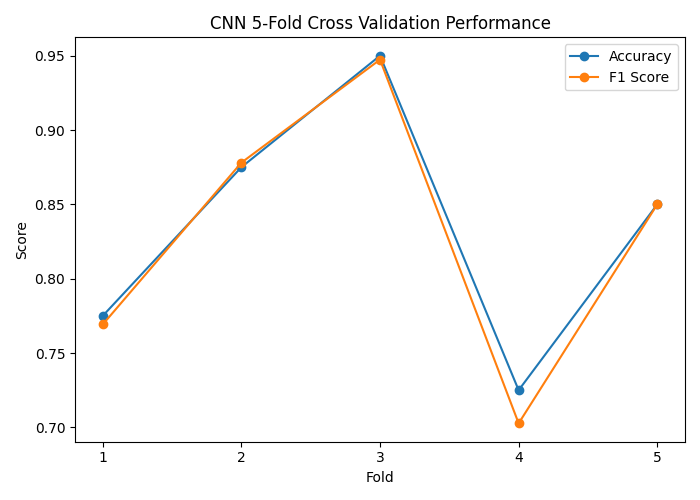

# 🍔 Food Delivery Time Prediction using CNN and Model Validation

## 🧠 Food Delivery Classification using Convolutional Neural Networks (CNN)

---

## 👤 Author

**Sagnik Patra**

---

## 📌 Project Overview

This project builds an end-to-end **Food Delivery Time Prediction System** using **Deep Learning (CNN)** and traditional Machine Learning techniques.

The system predicts whether a food delivery will be **Fast** or **Delayed** using customer location, restaurant location, weather conditions, traffic conditions, delivery experience, order priority, ratings, and other delivery-related features.

The project performs complete:

- Data preprocessing
- Feature engineering
- Distance calculation using Haversine Formula
- Time-based feature extraction
- CNN model development
- Logistic Regression comparison
- Cross-validation
- Hyperparameter tuning
- Performance evaluation
- Automated report generation

---



---

## 🎯 Objectives

### Phase 1 – Data Preprocessing & Feature Engineering

- Load Food Delivery dataset
- Handle missing values
- Encode categorical variables
- Normalize numerical features
- Calculate geographical distance using Haversine Formula
- Create Rush Hour and Time-based features
- Generate delivery status labels (Fast / Delayed)

### Phase 2 – Convolutional Neural Network (CNN)

- Convert tabular delivery data into image-like representations
- Build CNN architecture
- Train CNN classifier
- Predict Fast vs Delayed deliveries
- Compare CNN against Logistic Regression

### Phase 3 – Model Evaluation & Validation

- Confusion Matrix
- ROC Curve
- Accuracy
- Precision
- Recall
- F1 Score
- K-Fold Cross Validation
- Hyperparameter Tuning

---

# 📂 Dataset

Dataset Used:

```text
Food_Delivery_Time_Prediction.csv
```

Example features:

| Feature | Description |
|----------|-------------|
| Customer_Location | Customer coordinates |
| Restaurant_Location | Restaurant coordinates |
| Distance | Delivery distance |
| Weather_Conditions | Weather situation |
| Traffic_Conditions | Traffic level |
| Delivery_Person_Experience | Rider experience |
| Order_Priority | Priority level |
| Vehicle_Type | Delivery vehicle |
| Restaurant_Rating | Restaurant rating |
| Customer_Rating | Customer rating |
| Delivery_Time | Actual delivery time |

---

# ⚙️ Feature Engineering

The following features are automatically generated:

### 📍 Geographical Features

- Customer Latitude
- Customer Longitude
- Restaurant Latitude
- Restaurant Longitude
- Haversine Distance

### ⏰ Time Features

- Order Hour
- Rush Hour Indicator

### 🚚 Delivery Features

- Experience Level
- Order Priority
- Vehicle Type

### 🌦 Environmental Features

- Weather Conditions
- Traffic Conditions

---

# 🔍 Data Preprocessing

### Missing Value Handling

- Median Imputation for numerical columns
- Most Frequent Imputation for categorical columns

### Encoding

- One-Hot Encoding for categorical variables
- Label Encoding for target variable

### Feature Scaling

- StandardScaler

---

# 🏷 Target Variable Creation

The target variable is generated automatically from Delivery Time.

### Fast Delivery

```text
Delivery Time ≤ Median Delivery Time
```

### Delayed Delivery

```text
Delivery Time > Median Delivery Time
```

---

# 🧠 CNN Architecture

The project uses a custom CNN architecture.

```text
Input Layer

↓

Conv2D + ReLU

↓

Batch Normalization

↓

MaxPooling

↓

Conv2D + ReLU

↓

Batch Normalization

↓

MaxPooling

↓

Flatten

↓

Dense Layer

↓

Dropout

↓

Output Layer (Sigmoid)
```

---

# 🤖 Logistic Regression Baseline

A Logistic Regression model is trained as a baseline model.

Comparison metrics:

- Accuracy
- Precision
- Recall
- F1 Score

---

# 🔄 K-Fold Cross Validation

The CNN model is validated using:

```text
5-Fold Stratified Cross Validation
```

Each fold computes:

- Accuracy
- Precision
- Recall
- F1 Score

Average performance is reported.

---

# 🎛 Hyperparameter Tuning

Several CNN configurations are evaluated:

### Tuned Parameters

- Number of Filters
- Kernel Size
- Learning Rate
- Dense Units
- Dropout Rate

Best configuration is selected automatically.

---

# 📈 Evaluation Metrics

The following metrics are generated:

### Classification Metrics

- Accuracy
- Precision
- Recall
- F1 Score

### Visualization Metrics

- Confusion Matrix
- ROC Curve
- Training Accuracy Curve
- Training Loss Curve
- Cross Validation Curve

---

# 📊 Generated Visualizations

### CNN Confusion Matrix

```text
cnn_confusion_matrix.png
```

### ROC Curve

```text
cnn_roc_curve.png
```

### Training Accuracy

```text
cnn_training_accuracy.png
```

### Training Loss

```text
cnn_training_loss.png
```

### Model Comparison

```text
model_comparison_graph.png
```

### Cross Validation Performance

```text
cnn_cross_validation_graph.png
```

---

# 📁 Generated Output Files

The project automatically generates:

## Processed Data

```text
processed_food_delivery_data.csv
```

## Predictions

```text
cnn_predictions.csv
```

## Cross Validation Results

```text
cnn_cross_validation_results.csv
```

## Hyperparameter Results

```text
cnn_hyperparameter_tuning_results.csv
```

## Model Comparison Results

```text
model_comparison_results.csv
```

## Classification Report

```text
cnn_classification_report.txt
```

## Final Report

```text
final_report.txt
```

## Trained CNN Model

```text
cnn_food_delivery_model.h5
```

---

# 📂 Project Structure

```text
Food Delivery Time
│
├── Food_Delivery_Time_Prediction.csv
│
├── processed_food_delivery_data.csv
├── cnn_predictions.csv
├── cnn_cross_validation_results.csv
├── cnn_hyperparameter_tuning_results.csv
├── model_comparison_results.csv
│
├── cnn_confusion_matrix.png
├── cnn_roc_curve.png
├── cnn_training_accuracy.png
├── cnn_training_loss.png
├── cnn_cross_validation_graph.png
├── model_comparison_graph.png
│
├── cnn_classification_report.txt
├── final_report.txt
│
├── cnn_food_delivery_model.h5
│
└── README.md
```

---

# 🚀 Technologies Used

### Programming Language

- Python 3.x

### Data Processing

- NumPy
- Pandas

### Visualization

- Matplotlib

### Machine Learning

- Scikit-Learn

### Deep Learning

- TensorFlow
- Keras

---

# 📋 Workflow

```text
Load Dataset
      ↓
Data Cleaning
      ↓
Feature Engineering
      ↓
Distance Calculation
      ↓
Encoding & Scaling
      ↓
Target Creation
      ↓
CNN Training
      ↓
Logistic Regression
      ↓
Cross Validation
      ↓
Hyperparameter Tuning
      ↓
Model Evaluation
      ↓
Report Generation
```

---

# 🏆 Results

The project demonstrates:

✅ Effective food delivery classification

✅ CNN-based deep learning implementation

✅ Logistic Regression baseline comparison

✅ Cross-validation performance analysis

✅ Hyperparameter optimization

✅ Automated reporting and visualization

---

# 🔮 Future Enhancements

- Real-time delivery prediction API
- Route image integration using map services
- Transfer Learning CNN models
- Mobile deployment
- Traffic API integration
- Weather API integration
- Delivery route visualization
- Explainable AI (XAI)

---

# 📜 License

This project is developed for educational and research purposes.

---

# ⭐ Acknowledgements

Special thanks to:

- TensorFlow Team
- Scikit-Learn Developers
- Keras Contributors
- Open Source Community

---

## 📧 Contact

**Sagnik Patra**

GitHub: https://github.com/sagnik1-patra

LinkedIn: https://www.linkedin.com/in/sagnik2212/

---
**Food Delivery Time Prediction using CNN and Model Validation**
